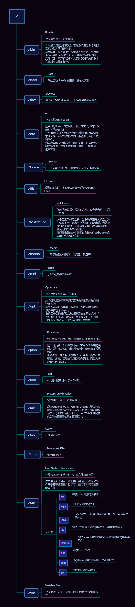

| u    | g     | o        |
|:-----|:------|:---------|
| user | group | other    |
| 属主 | 组    | 其他用户 |

| Action | weight | description |
|:-------|:-------|:------------|
| r--    | 4      | 读          |
| w--    | 2      | 写          |
| x--    | 1      | 执行        |
| rwx    | 7      | 读+写+执行  |
| rw-    | 6      | 读+写       |
| r-x    | 5      | 读+执行     |
| -wx    | 3      | 写+执行     |

|   |                                                            |
|:--|:-----------------------------------------------------------|
| d | 目录(directory)                                            |
| - | 文件(regular file)                                         |
| s | 套字文件(socket)                                           |
| p | 管道文件(pipe)或命名管道文件(named pipe)                   |
| l | 符号链接文件(symbolic link)                                |
| b | 该文件是面向块的设备文件(block-oriented device file)       |
| c | 该文件是面向字符的设备文件(character-oriented device file) |

| Directory   | Description                                     |
|:------------|:------------------------------------------------|
| /bin        | 存放 **命令**                                   |
| /sbin       | 存放超级命令                                    |
| /sys        | 存放系统信息                                    |
| /boot       | 存放 **启动系统** 的核心文件                    |
| /dev        | 存放 **设备文件**                               |
| /etc        | 存放系统配置文件                                |
| /home       | **用户家目录**                                  |
| /lib        | 存放系统 **库文件**                             |
| /lost+found | 存放系统异常时丢失的文件                        |
| /media      | 用于加载各种 **媒体**                           |
| /mnt        | 用于加载各种文件系统                            |
| /opt        | **用于存放第三方软件**                          |
| /root       | 超级用户家目录                                  |
| /proc       | **进程**目录，是个虚拟目录                       |
| /usr        | 存放普通用户的 **应用程序、库文件和文档** 等     |
| /var        | 存放那些在时间、大小、内容上会 **经常变化的文件** |

