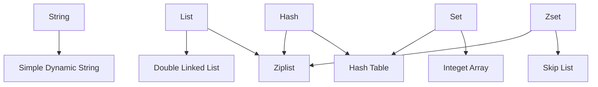

# Type: String

| command     | syntax                            | description                                                          | example                   | return                                 |
|-------------|-----------------------------------|----------------------------------------------------------------------|---------------------------|----------------------------------------|
| set         | `SET key value`                   | set a pair of key-value                                              | `set name boii`           | OK                                     |
| get         | `GET key`                         | get the value of key                                                 | `get name`                | "boii"                                 |
| mset        | `MSET key value [key value ...]`  | set more pair of key-value at one time                               | `mset name boii age 18 `  | OK                                     |
| mget        | `MGET key [key ...]`              | get more values of key-value at one time                              | `mget name age`           | "boii" "18"                            |
| setex       | `SETEX key seconds value`         | shortcut of `SET key value` + `EXPIRE key seconds`                   | `setex name 5 boii`       | OK                                     |
| psetex      | `PSETEX key seconds value`        | shortcur of `SET key value` + `PEXPIRE key microseconds`             | `psetex name 5000 boii`   | OK                                     |
| setnx       | `SETNX key value`                 | set a pair of key-value **if key isn't exists**                      | `setnx name boii`         | 1 if successful, otherwise 0           |
| msetnx      | `SETNX key value [key value ...]` | set more pair of key-value if **all key** isn't exists               | `msetnx name boii age 18` | 1 if all key isn't exists, otherwise 0 |
|             |                                   |                                                                      |                           |                                        |
| getset      | `GETSET key newValue`             | get the value of key and set the new value                           | `getset name eva`         | "boii"                                 |
| strlen      | `SETLEN key`                      | return the length of key's value                                     | `strlen name`             | 4                                      |
| append      | `APPEND key value`                | append the new value after the value of key                          | `append name good`        | 8                                      |
| getrange    | `GETRANGE key start end`          | similar to slice but include end character, -1 means until the end   | `getrange name 0 5`       | "boiigo"                               |
|             |                                   |                                                                      |                           |                                        |
| decr        | `DECR key`                        | decrease one from a numeric value, similar `key--`                   | `decr age`                | 17                                     |
| decrby      | `DECRBY key decrement`            | similar `key -= decrement`                                           | `decrby age 10`           | 7                                      |
| incr        | `INCR key`                        | increase one from a numeric value, similar `key++`                   | `incr age`                | 8                                      |
| incrby      | `INCRBY key increment`            | similar `key += increment`                                           | `incrby age 100`          | 108                                    |
| incrbyfloat | `INCRBYFLOAT key increment`       | increase a float value to a numeric value, Maximum 17 decimal places | `incrbyfloat age 0.5`     | 108.5                                  |

## SET & GET 

## Manipulation

## Calculation

## Underlying Data Structure

ZSet is implemented by Ziplist and Skip List.

If the numbers of ZSet element is less than 128, OR the size of all ZSet elements is less than 64 bytes, the Ziplist is used, otherwise the Skip List is used.
- Use Skip List: When 
    
    When `ZCARD key` < 128 || 