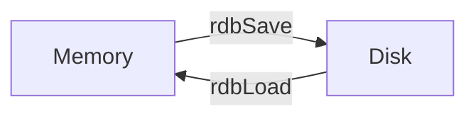

# Persistence principle

Redis runs on memory, but the memory capcity is not unlimited. So there will be insufficient memory.

To resolve this problem, Redis has 3 ==Data Elimination Strategy==.

1. **RDB**: Redis Database File (Default).
2. **AOF**: Append Only File.
3. **Algorithm**: 
    - ***volatile-lru*** : Delete a ==L== east ==R== ecently ==U== sed key from {++the keys that **sets expire**++} when memory is deficient.
    - ***volatile-lfu*** : Delete a ==L== east ==F== requently ==U== sed key from {++the keys that **sets expire**++} when memory is deficient.
    - ***volatile-random*** : Delete a key ==Randomly== from {++the keys that **sets expire**++} when memory is deficient. 
    - ***volatile-ttl*** : Delete the key with the **nearest expire time** (Minor TTL).
    - ***allkeys-lru*** : Delete a ==L== east ==R== ecently ==U== sed key from {++all keys++}.
    - ***allkeys-lfu*** : Delete a ==L== east ==F== requently ==U== sed key from {++all keys++}.
    - ***allkeys-random*** : Delete a key ==Randomly== from {++all keys++}.
    - ***noeviction*** : Just ^^returns an error^^ on write operations when memory is deficient.


## RDB

RDB is a **default memchanism** for Redis persistence. It is enable by default. This is a snapshot method. 

!!! tip
    What the `.rdb` file saves is {++the RELATIVELY latest DATA++}.



When it is enable, Redis will dump the data to the `.rdb` file automatically by the configured strategy.

1. RDB is a file used to persist data. It is a binary file and is easy to transmit.
2. But RDB can not ensure the absolute security of data due to the time interval of writing. 

    If the time interval is too short, efficiency declines.

    If the time interval is too long, if there is an accident before the next interval, the data written from last write to the accident will be lost.

There are 2 ways to trigger RDB updates: 

- Automatic 
- Manual

### Automatic way 
You can configure the strategy of time interval in the `redis.conf`:

```sh title="redis.conf"
# Specify save opportunity.
# When `redis-cli SHUTDOWN` command is executed, 
# the following setting also save the DB to disk.
# 
# As long as one item is satisfied, Redis will save the DB to disk.
# Configure format: save <seconds> <changes>
save 900 1      # Save if 1 data be written in 15 minutes.
save 300 10     # Save if 10 data be written in 5 minutes.
save 60 10000   # Save if 10000 data be written in 1 minutes.

# Compress the DB file
rdbcompression yes

# Specify the DB filename
dbfilename custom_file_name.rdb
```
As long as one item is satisfied, Redis will save the DB to disk.


### Manual way

You can actively send the command `SAVE` or `BGSAVE` to trigger updates.

The `SAVE` command will block current process, update data, and then resume.

The `BGSAVE` command will not block current process. It calls the `fork()` (a linux system call) to create the child process.


!!! tip
    the Automatic way is a BGSAVE.

??? example

    ```sh
    > BGSAVE
    Background saving started
    ```

### RDB File structure


RDB file consists of 5 base parts: `Magic number`, `Version`, `Data`, `EOF`, `Checksum`.


- **Magic number**: It is 5 characters --"REDIS", used to indicate this is a Redis file. 5 bytes.
- **Version**: It means the redis version. 4 bytes.
- **Data**: If there is no data, it is 0 byte.
- **EOF**: A common end-of-file symbol, used to indicate the end of file. 1 byte.
- **Checksum**: It is a 8 bytes unsigned integer, generated by digest algorithm, used to check whether the file is complete. 


The part of data is consists of: `SELECTDB symbol`, `Database number` and  `Key-Value pairs`.

- **SELECTDB symbol**: It is a constant. 1 byte. When the reading program read this value, it will know the next section is a database num.
- **Database number**: Depending on the size of number, the length of this section can be 1, 2, or 5 bytes. When the reading program read this value, it will call the `SELECT` command to switch current database.
- **Key-Value pairs**: This part is the real data.


The part of Key-Value pairs is consists of: `TYPE`, `Key`, `Value`. If the expiration time is set, there will include the `EXPIRE_MS symbol` and `Timestamp`.

- **TYPE**: This records the type of value, it can be one of the following constant:
    
    - REDIS_RDB_TYPE_STRING
    - REDIS_RDB_TYPE_LIST
    - REDIS_RDB_TYPE_SET
    - REDIS_RDB_TYPE_ZSET
    - REDIS_RDB_TYPE_HASH
    - REDIS_RDB_TYPE_LIST_ZIPLIST
    - REDIS_RDB_TYPE_SET_INTSET
    - REDIS_RDB_TYPE_ZSET_ZIPLIST
    - REDIS_RDB_TYPE_HASH_ZIPLIST

    Each constant represents an underlying encoding. Where redis-server reading key-value pairs, how to read and interpre the value depending on TYPE symbol.
    
- **Key**: Key is always a string object and is encoded the same way. The length of key varies depending on the length of the content. 

- **Value**: This is the place where the real data in. 
- **EXPIRE_MS symbol**: It tell the reading program the next section is an expiration time in milliseconds. 1 byte.
- **Timestamp**: This is an 8-byte lone signed integer. It records a UNIX timestamp.

The RDB file structure look like this:


## AOF
AOF means Append Only File. 

!!! tip
    What the `.aof` file saves is {++all the WRITTEN manipulation COMMAND++}.

    Note that AOF only stores WRITE instructions such as `HSET`, `DEL`, `ZREM`, `LPOP`.

    READ instructions, such as `HGET, LRANGE`, will not be stores.

- For data security, AOF mode is safer than RDB mode. 
- BTW, Redis official recommends to enable ^^both AOF mode and RDB mode^^.
- AOF mode is a ==higher== priority than RDB mode. After Redis goes down and restart, AOF file will be perferred to recover data.

AOF is not the default memchanism, you can configure it in the `redis.conf`:
```sh title="redis.conf"
# Specify synchronization opportunity (choose one)
#  - everysec: Each second records the operation to the AOF file. This is DEFAULT configure.
#  - always:   Each write operation records the operation to the AOF file, but efficiency is low.
#  - no:       Set different synchronization time intervals according to the runtime environment
appendfsync everysec 

# Enable the Append Only Mode
appendonly yes

# Specify the Append Only filename.
appendfilename custom_file_name.aof

```