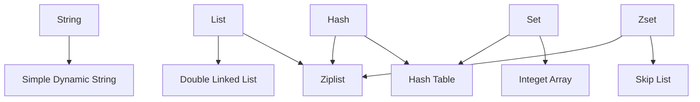

# Underlying 

## Data Structure

ZSet is implemented by Ziplist and Skip List.

If the numbers of ZSet element is less than 128, OR the size of all ZSet elements is less than 64 bytes, the Ziplist is used, otherwise the Skip List is used.
- Use Skip List:
    
    When `ZCARD key` < 128 || all ZSet elements < 64Byte
    